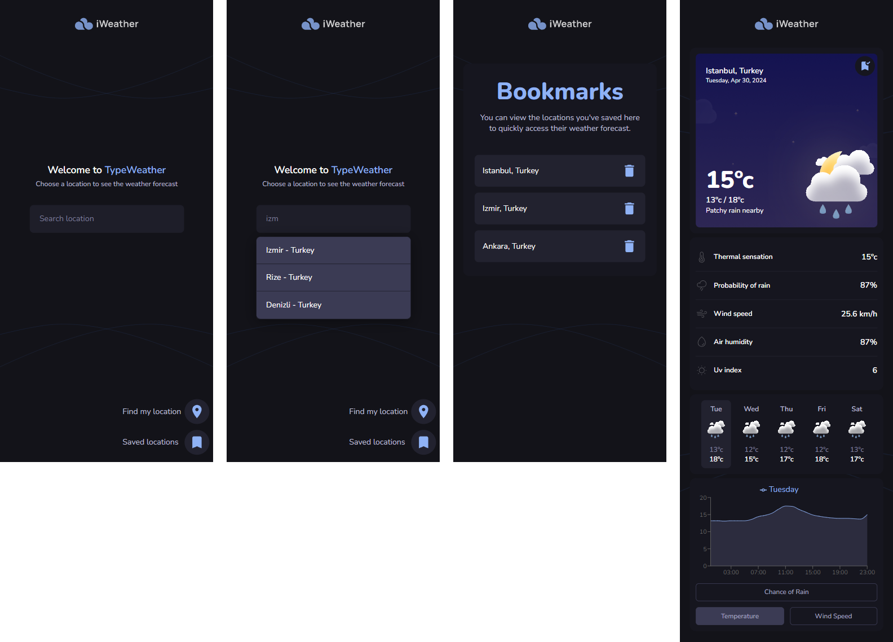

<h3 align="center">
    
</h3>
<div align="center">
    <p><i>This application was developed for internship assignment.<br> You can use the links below to see the UI design at Figma and related GitHub repository.</i></p>
    <a href="https://www.figma.com/file/CmZupOVTB1WkYfLwElyzLL/iWeather?type=design&node-id=3%3A376&mode=design&t=Fccntqhigcu1L8Xv-1" target="_blank"></a>
    <a href="https://github.com/React-Staj-2024/staj-2024-assesment"></a>
    <br>
    <br>
    
</div>

## Environment Variables

Environment variables must be set for the application to run properly.
First, copy the `.env.example` file and paste it as `.env.local.`
Then, obtain API keys from the following websites:

1. [Openweathermap](https://openweathermap.org/) helps find the user's location accurately. See details at [Geocoding API](https://openweathermap.org/api/geocoding-api).
2. [Weatherapi](https://www.weatherapi.com/) provides weather forecasts and current conditions based on the given latitude and longitude coordinates.

## Installation

```bash
git clone emirhansirkeci/iWeather
cd iWeather
npm install
```

## Available Commands

Run the application in development mode.

```bash
npm run dev
```

Preview command can be used to run the application in production mode. Before running the preview command, it is necessary to build the project. Once the build process is complete, you can run the preview command.

```bash
npm run build
npm run preview
```

## Adding New Locations

You can add new locations to `src/utils/places.json` to work with the autocomplete feature.

- **name (required):** The name of the city.
- **lat (required):** The latitude coordinate.
- **lon (required):** The longitude coordinate.

_For example, let's add Berlin to the list._

```json
[
  {
    "name": "osmaniye",
    "country": "turkey",
    "lat": 37.06805,
    "lon": 36.261589
  },
  {
    "name": "berlin",
    "country": "germany",
    "lat": 52.520008,
    "lon": 13.404954
  }
]
```

Now, Berlin will appear as a suggestion like `Berlin - Germany`.
